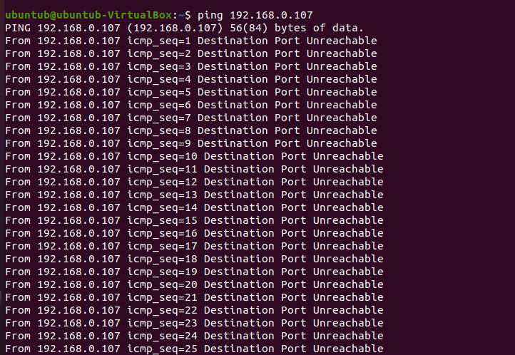

# Лабораторный отчет 2

### ФИО: Нгуен Динь Нам - К3140

## Выполните лабораторную работу 2.

1. Создайте новый файл с именем **`lab2.bash`**

2. Проверьте, есть ли у файла права на выполнение.

- Чтобы проверить, есть ли у файла права на выполнение в Linux, вы можете использовать команду `ls -l`.

- Если файл не имеет права на выполнение, я использую команду `chmod u+x lab2.bash`.

- Затем проверьте файл снова.

3. Откройте gedit для редактирования кода и выполнения задачи.

- Команда `read -p "Enter your ip:" t` запрашивает ввод IP-адреса у пользователя и сохраняет его в переменной t. Я создал переменные для решения задачи.

- Я разбил исходную строку на массив, чтобы обрабатывать каждое значение по отдельности.
 
- Я разбил исходную строку на массив, чтобы обрабатывать каждое значение по отдельности. Здесь я использую цикл `for`, начиная `с 0 до (len - 1)`, чтобы перебрать каждый символ в строке. Если элемент на позиции `i` равен **"."** , то я вырезаю подстроку `с j до i - 1` и сохраняю в массив s, затем обновляю переменную `j`. Если `i == (len - 1)`, то я вырезаю подстроку с позиции j до конца строки.

- Создайте функцию **`decimal_to_binary`** для преобразования целого числа в двоичное представление. Цикл `while` продолжает выполняться, пока `t` больше 0. На каждой итерации остаток от деления `tmp` на 2 (0 или 1) добавляется в начало двоичной строки `s_binary`, а затем `t` делится на 2 для дальнейшего преобразования.

- Создайте функцию **`check_ip`**, чтобы проверить, является ли значение допустимым. Используйте цикл `for` для перебора каждого элемента массива. Если элемент с индексом `i` не находится в диапазоне **от 0 до 255** и длина массива **не равна** 4, то введённая строка недействительна, и переменная ``check_value`` равна 0.

- Функция **`join_string`** будет выполнять соединение строк. Используйте цикл `for` для перебора каждого элемента в массиве `arr_ip`. Создайте переменную `len_ip` для хранения текущей длины строки элемента. Если `len_ip < 8`, то добавьте 0 перед этой строкой и продолжайте, пока `len_ip` не станет равным 8. После завершения цикла переменная `result` будет использоваться для соединения строк.

- Вызовите функцию **`check_ip`** и проверьте значение введённой строки. Если оно верно, программа будет выполнена, если нет, выведите **"value not valid"**.

- Используйте цикл `for` для перебора элементов в массиве `s`. Если элемент на данной позиции равен 0, то `s_Binary = 0`. В противном случае вызовите функцию **`decimal_to_binary`** для преобразования в двоичное число.

- Затем сохраните это двоичное число в массиве `arr_ip`. Вызовите функцию **`join_string`** для соединения строк.

- Поскольку в начале строки осталась лишняя точка, необходимо обрезать её с первого символа до конца строки.

- Затем выведите на экран IP-адрес после преобразования в двоичную систему.

4. Тестирование.

А вот результат после преобразования из целого числа в двоичное представление:

- Корректный IP-адрес.

- Неверный IP-адрес.

