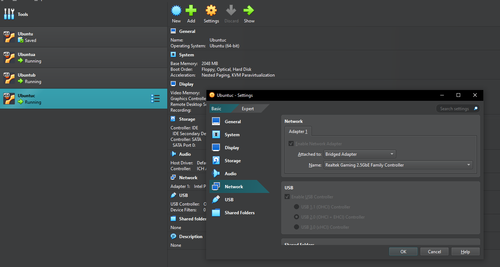

# Лабораторный отчет 3

### ФИО: Нгуен Динь Нам - К3140

## Выполните лабораторную работу 3.

1. Настройка виртуальной **машины А** (Ubuntu) с доступом в интернет

- Создайте виртуальную машину A и настройте сеть виртуальной машины A.

- Выберите тип сетевого подключения: выберите `Bridge Adapter`.


- Чтобы проверить подключение к Интернету виртуальной машины A, используйте следующую команду: **`ping google.com`**

***Если подключение к интернету успешно, получите ответ от сервера Google.***


2. Настройка виртуальной **машины B**

- Создайте виртуальную машину B и настройте сеть виртуальной машины B.

- Выберите тип сетевого подключения: выберите `Bridge Adapter`.


3. Проверьте сетевое соединение от машины А к машине Б.

- Определите IP-адрес машины A и машины B с помощью команды ```ifconfig```.


- IP-адрес машины A — 192.168.0.55.


- IP-адрес машины B — 192.168.0.75.

- Используйте команду `ping`, чтобы проверить сетевое соединение от машины А к машине Б. В случае успеха будет ответ от машины Б.


4. Настройка виртуальной **машины C**

- Создайте виртуальную машину C и настройте сеть виртуальной машины C.

- Выберите тип сетевого подключения: выберите `Bridge Adapter`.



5. Проверьте сетевое соединение от машины А к машине C.

- Определите IP-адрес машины C с помощью команды ```ifconfig```.


- IP-адрес машины C — 192.168.0.107.

- Используйте команду `ping`, чтобы проверить сетевое соединение от машины А к машине C. В случае успеха будет ответ от машины C.


6. Заблокировать доступ с машины B на машине C

- Откройте терминал на машине C.

- Проверьте текущее подключение между машиной B и машиной C.


- Чтобы заблокировать доступ с машины B на машину C, можно использовать команду **`iptables`** для настройки фаервола и добавления правил, которые будут блокировать доступ с машины B.

```
sudo iptables -A INPUT -s 192.168.0.75 -j REJECT
```
- Используйте команду `sudo iptables -L -n -v`, чтобы проверить, были ли добавлены правила


- Проверьте подключение с машины B к машине C.


- Машина B не может получить никаких ответов от машины C, потому что доступ был заблокирован.
